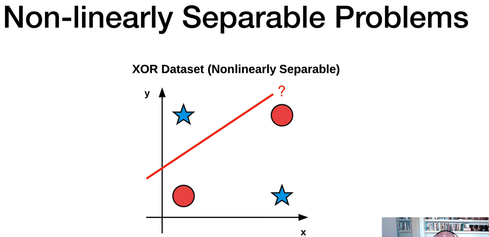

# KNN-classify-images

Multi-layer Neural Networs:
- Trained via backpropagation
- can solve non-linearly separable problems (when the right activation function is used)

Non-linearly separable problems:
- Nearly all real-word problems are non-linearly separable (License plate, face recognition...)
- NNs with two or mode hidden layers can learn such functions, provided that:
    - We initialize our NN weights in an intelligent manner
    - We use a good activation function

Image classification/ Object-detection/ image-segmentation pipeline
1. Gather your dataset
2. Split your dataset
3. Train your network/model
4. Evaluate

-------------------------------------------
KNN classify images:
k = 1 means, one neighbour
whatever the class label distance is minimises we gona endup with choosig that class

Distance is calculated by:
- Ecludian distance or
- chai-square distance

KNN - 
- is not intelligent algorithm, it is not learning any underline patterns.
- It just computing the distances in n dimentional space ranking them and performing a vote.
- It take a lookup yiur neighbour and take a vote and do a classification

- it is not learning atall. It is just relay on distance scoring function
- while saving the model,we also need to save the dataset
- it is coputationallly expensive, bcz for larze datasets we have o loop over the each image and compute the 
equilidan distance. and rank them and sort them

Note: for the NN the model size will not change regardless of 5 images or 5 million images. but we spend on traing,
to learning patterns on underlying data

